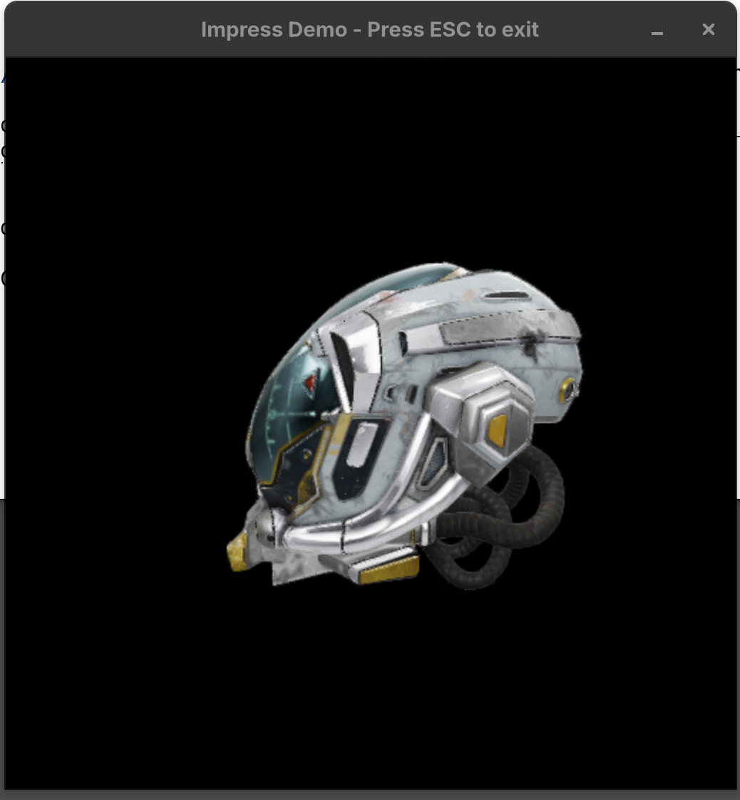

# Impress Shared Library Demo

This project demonstrates how to build the Impress rendering engine as a shared library, export its headers, and integrate them into a non-Bazel build system.

Specifically, `rust_demo` is an example of integrating the Impress shared library with the **Cargo** build system.

<p align="center">
  
</p>

## 1. Building the Impress Shared Library and Headers

To build the Impress shared library and package its headers, first run the setup script (located at `/usr/local/google/home/cjdaly/git/aaos_prototype/impress/bazel_setup.sh`) to install dependencies and configure the Android NDK:

```bash
source ./bazel_setup.sh
```

If you encounter errors about missing standard C++ headers (like `<cstdint>`), you may also need to install `libc++`:

```bash
sudo apt install libc++-dev libc++abi-dev
```

Then run the following commands from the root of the Impress repository:

> **NOTE**: The commands below build for Linux by default. You can also build for Android by passing one of the following flags to the Bazel command:
> - `--config=android_arm64-v8a`
> - `--config=android_x86_64`
> - `--config=android_armeabi-v7a`
> - `--config=android_x86_32`

```bash
# Build the shared library
bazel build //shared_library:impress --config=linux_libstdc++

# Build and package the headers
bazel build //shared_library:impress_headers --config=linux_libstdc++
```

### Output and Usage

- **`bazel-bin/shared_library/libimpress.so`**: The compiled shared library containing the Impress Engine.
- **`bazel-bin/shared_library/impress_headers.zip`**: An archive containing all C++ headers required to use the library.

> **Caution**: The `export_headers.bzl` script normalizes the include paths inside the zip so that external projects only need to add a single include folder (`impress_headers/`) to resolve all dependencies natively.
> Only this demo has been verified. Some headers might not line up correctly for other use cases. If you run into build issues with missing headers, you may need to modify `HEADER_MAPPINGS` in `export_headers.bzl` to add custom path translations.

## 2. Running the Rust Demo

To build and run the Rust application, first extract the headers (from the repo root) and then run the app:

```bash
# From repo root
unzip -o bazel-bin/shared_library/impress_headers.zip -d shared_library/impress_headers

# From shared_library/rust_demo
LD_LIBRARY_PATH=../../bazel-bin/shared_library cargo run
```

#### What this demo does
- Opens a $1024 \times 1024$ window using the `minifb` library.
- Passes the raw OS window handle to the C++ Impress bridge.
- Loads the `DamagedHelmet.glb` model from a memory buffer.
- Renders the model spinning in the window using Filament (Impress's backend).

#### Limitations
- Does not support window resizing or interactive camera controls.
- In this example, Filament renders directly to the GPU surface, not an offscreen buffer.

#### Architecture
- **`rust_demo/src/main.rs`**: The entry point. It creates the window, gets the raw handle, and calls the C++ bridge via FFI.
- **Rust Bridge (`rust_demo/src/rust_bridge.h/.cc`)**: A facade layer exposed to Rust via the `cxx` crate. It manages the lifetime of the `imp::ViewHost` and initializes the rendering context.
- **`rust_demo/src/sample_view.h/.cc`**: The custom Impress view implementation. It handles loading the asset and setting up the scene graph.

## Credits and Licensing

The `DamagedHelmet.glb` model used in this demo is from the [Khronos Group glTF-Sample-Assets repository](https://github.com/KhronosGroup/glTF-Sample-Assets).

It is licensed under the **Apache License, Version 2.0**. 

Pursuant to the license, here is the attribution:
- **Model**: Damaged Helmet
- **Source**: Khronos Group
- **License**: Apache 2.0